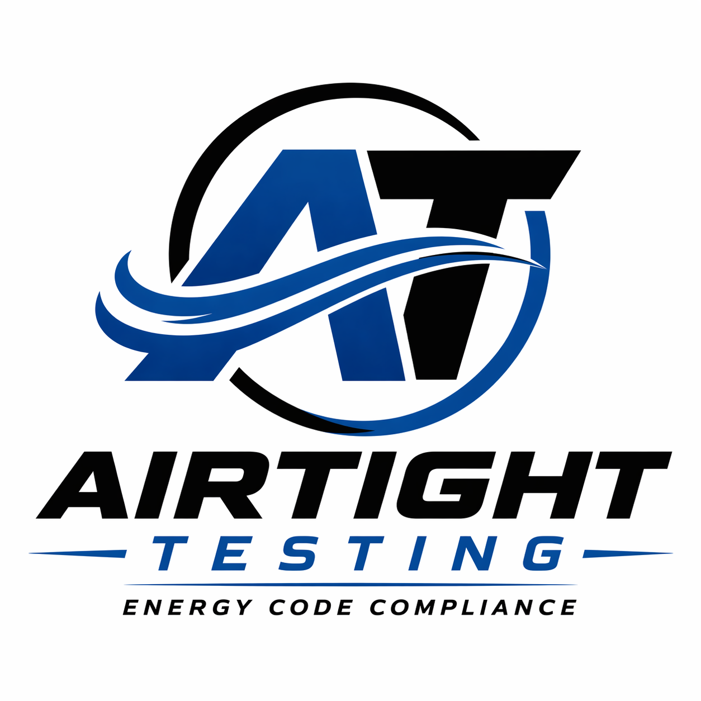

# 🚀 Airtight Testing

<p align="center">
  
</p>

<p align="center">
  <strong>Certified Energy Code Compliance Rater</strong><br/>
  Serving Santa Barbara, San Luis Obispo, and Monterey Counties
</p>

<p align="center">
  <a href="https://airtight-testing.vercel.app">
    
  </a>
  
  
</p>

---

## 🌐 Live Website

👉 https://airtight-testing.vercel.app

---

## 📌 About the Project

This is the official website for **Airtight Testing**, providing professional energy compliance services for builders, contractors, and homeowners.

The site is designed to:

* Showcase services
* Build trust with certifications
* Provide easy contact access
* Convert visitors into clients

---

## 💼 Services Offered

✔️ Title 24 Energy Code Compliance
✔️ HERS Field Verification
✔️ Energy Code Compliance Documentation
✔️ Duct Testing Coordination

---

## 🏆 Certifications & Trust

* Certified Energy Compliance Rater
* CHEERS Registered Provider

---

## 🛠 Tech Stack

* ⚛️ React (Frontend)
* ⚡ Vite (Build Tool)
* 🎨 Inline Styling (Custom UI)
* ▲ Vercel (Deployment)

---

## 📂 Project Structure

```bash
src/
  ├── App.jsx        # Main UI layout
  ├── main.jsx       # Entry point

public/
  ├── images         # Logos, badges, assets
```

---

## 🚀 Deployment

This project uses **Vercel for automatic deployment**.

Any updates pushed to GitHub are:

1. Built automatically
2. Deployed instantly
3. Live within seconds

---

## 📞 Contact

📱 Phone: (805) 471-9629
📧 Email: [thew8@gmail.com](mailto:thew8@gmail.com)

---

## 🔧 Future Improvements

* Contact form with email integration
* Google Reviews integration
* SEO optimization
* Custom domain setup
* Mobile UI enhancements

---

## 💡 Author

Built and maintained for **Airtight Testing**

---

## 📄 License

Private business use only.
